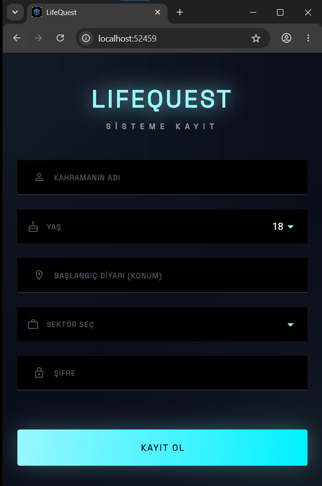
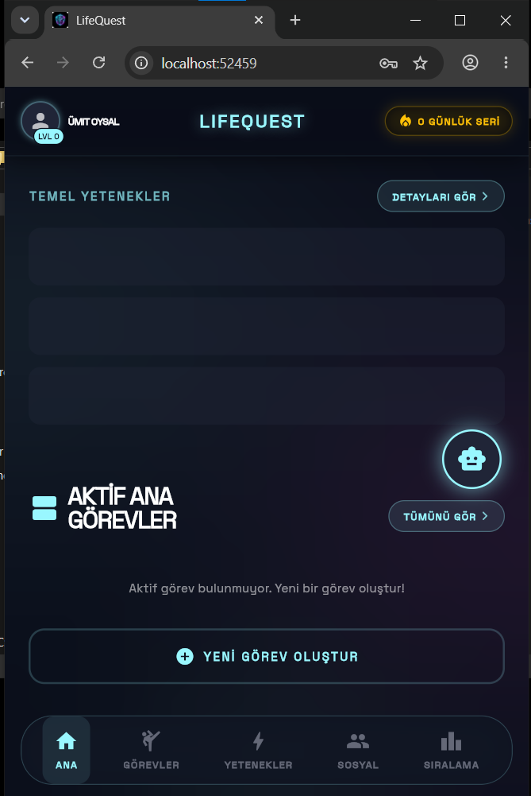
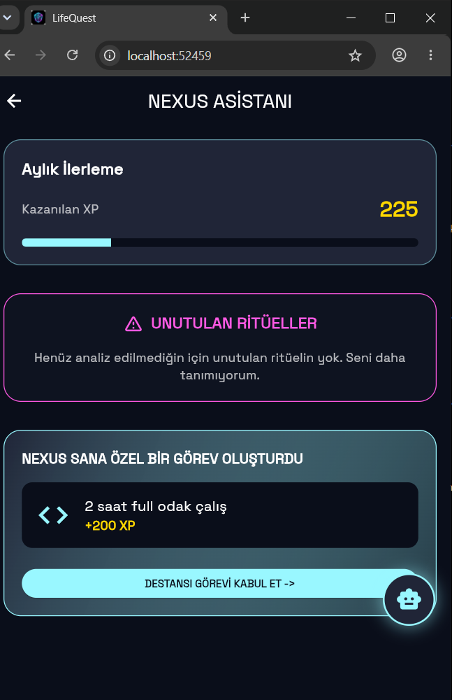
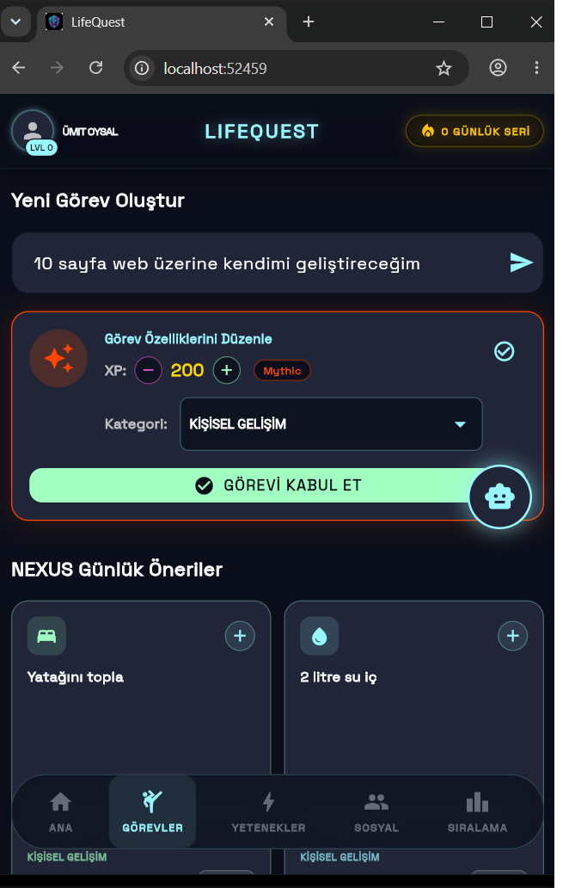
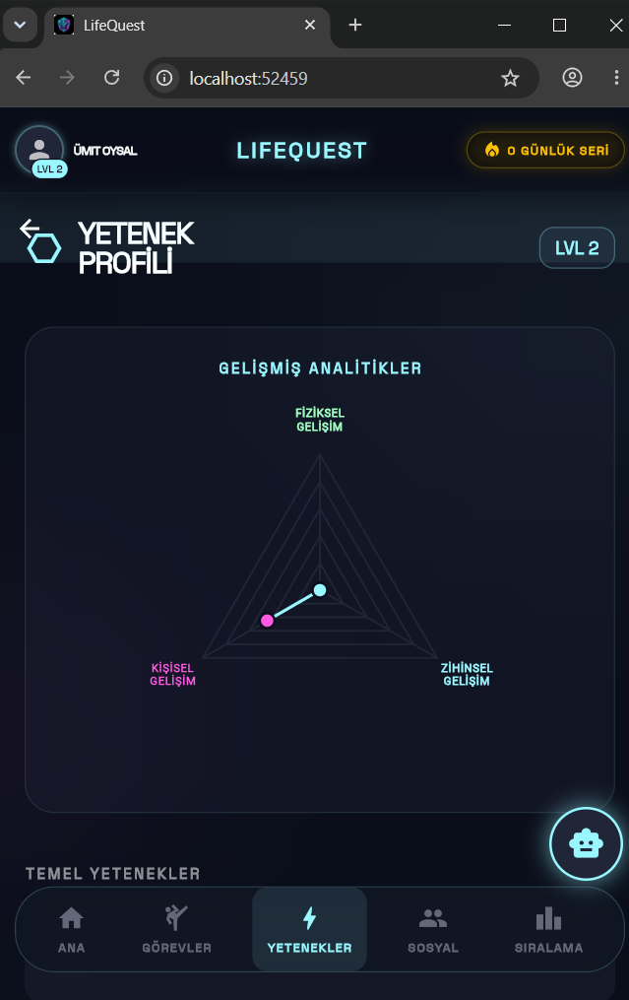
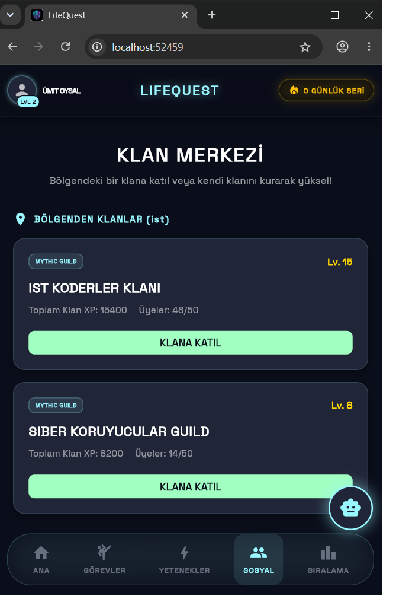
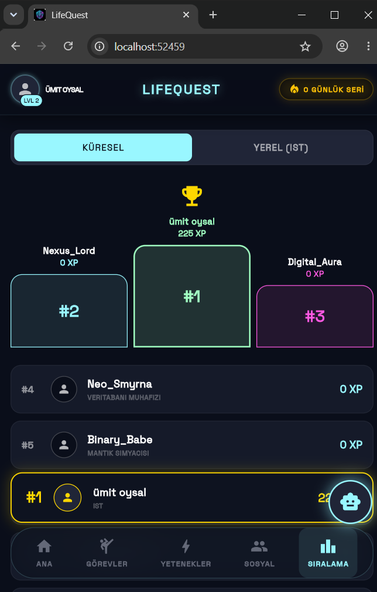

# LifeQuest - AI Destekli RPG Verimlilik Oyunu 🎮⚡

[](https://flutter.dev)
[](https://dart.dev)
[](https://ai.google.dev)
[](LICENSE)

---

## 🎓 Öğrenci ve Proje Bilgileri

| Alan | Bilgi |
|---|---|
| **Öğrenci Adı Soyadı** | Ümit Oysal |
| **Öğrenci Numarası** | 24010501028 |
| **Bölüm** | Bilgisayar Programcılığı |
| **Üniversite** | İstanbul Topkapı Üniversitesi |
| **GitHub Kullanıcı Adı** | [umitoysal11](https://github.com/umitoysal11) |
| **🔗 GitHub Proje Bağlantısı** | [https://github.com/umitoysal11/LifeQuest](https://github.com/umitoysal11/LifeQuest) |

---

## 📌 Projenin Amacı ve Kısa Açıklaması

**LifeQuest**, günlük hayatı siberpunk temalı bir rol yapma oyununa (RPG) dönüştüren, yapay zeka destekli mobil verimlilik ve alışkanlık takip uygulamasıdır.

Kullanıcılar serbest metin olarak bir görev yazarlar (örneğin *"Bugün 30 dakika kitap okudum"*). Uygulama bu görevi analiz ederek XP (deneyim puanı) ve kategori atar. Kazanılan XP ile karakter seviyelenir; Fiziksel, Zihinsel ve Kişisel Gelişim yetenekleri dinamik radar grafikleriyle görselleştirilir. Nexus Asistanı ise her gün kullanıcıya özel destansı görevler (Epic Quests) üretir ve kullanıcının gelişimini proaktif biçimde takip eder.

Proje, **Antigravity UI** ve **Retro-Futurism HUD Design** ilkeleri doğrultusunda, modern monokrom ve neon detaylı bir siberpunk arayüzüyle tasarlanmıştır.

---

## 🛠️ Kullanılan Teknolojiler ve Kütüphaneler

| Teknoloji / Kütüphane | Sürüm | Kullanım Amacı |
|---|---|---|
| **Flutter** | 3.12.0 | Çapraz platform mobil uygulama geliştirme çerçevesi |
| **Dart** | 3.12.0 | Programlama dili |
| **Material 3 (M3)** | Flutter ile dahili | Modern UI bileşen kütüphanesi ve tema sistemi |
| **google_fonts** | ^8.1.0 | Space Grotesk ve diğer Google yazı tiplerinin entegrasyonu |
| **lottie** | ^3.3.3 | JSON tabanlı vektör animasyonları |
| **rive** | ^0.14.7 | İnteraktif gerçek zamanlı vektör animasyonları |
| **confetti** | ^0.8.0 | Görev tamamlandığında tetiklenen konfeti efekti |
| **google_generative_ai** | ^0.4.7 | Gemini AI entegrasyonu (görev analizi ve NLP) |
| **flutter_launcher_icons** | ^0.13.1 | Android ve Web için uygulama simgesi üretme aracı |

---

## 📂 Proje Klasör Yapısı

```text
LifeQuest/
├── android/                  # Android platformu için yerel derleme ve entegrasyon kodları
├── assets/                   # Uygulama içi statik dosyalar
│   └── logo/
│       └── app_icon.png      # AI tarafından tasarlanan siberpunk uygulama simgesi
├── images/                   # Tanıtım materyalleri
│   └── screenshot/           # GitHub README için uygulama ekran görüntüleri
│       ├── kayıtekran.png
│       ├── anasayfa.png
│       ├── asistansayfa.png
│       ├── görevlersayfa.png
│       ├── yeteneklersayfa.png
│       ├── sosyalsayfa.png
│       └── sıralamasayfa.png
├── lib/                      # Uygulama kaynak kodları (Dart)
│   ├── main.dart             # Uygulama giriş noktası ve M3 tema konfigürasyonu
│   ├── screens/              # Uygulama ekranları (UI Katmanı)
│   │   ├── active_quests_screen.dart    # Aktif görevler listesi
│   │   ├── assistant_screen.dart        # Nexus AI Asistanı ekranı
│   │   ├── home_screen.dart             # Ana HUD paneli ve radar grafiği
│   │   ├── leaderboard_screen.dart      # Bölgesel ve küresel sıralama tabloları
│   │   ├── main_navigation_screen.dart  # 5 sekmeli glassmorphism navigasyon paneli
│   │   ├── profile_screen.dart          # Kahraman profil ekranı
│   │   ├── quest_board_screen.dart      # Görev oluşturma ve yönetim paneli
│   │   ├── register_screen.dart         # Kahraman oluşturma / kayıt ekranı
│   │   ├── skills_screen.dart           # Yetenek ağacı ve XP ilerleme grafikleri
│   │   └── social_screen.dart           # Klan kurma, yönetme ve Raid ekranı
│   ├── state/
│   │   └── app_state.dart               # ChangeNotifier tabanlı merkezi uygulama durumu
│   ├── theme/
│   │   └── app_colors.dart              # Neon ve siberpunk renk paleti tanımlamaları
│   └── widgets/
│       └── companion_overlay.dart       # Köşedeki dinamik yardımcı asistan widget'ı
├── web/                      # Web tarayıcı platformu için PWA ayarları
├── pubspec.yaml              # Proje bağımlılıkları ve genel Flutter ayarları
└── README.md                 # Proje dokümantasyonu
```

---

## ⚙️ Kurulum Adımları

### 1. Gereksinimler
- [Flutter SDK](https://docs.flutter.dev/get-started/install) **(v3.12.0 veya üzeri)** kurulu olmalıdır.
- Dart SDK (Flutter ile birlikte kurulur)
- Android Studio veya VS Code (Flutter eklentisi kurulu olmalı)
- Aktif internet bağlantısı

### 2. Projeyi Klonlayın ve Bağımlılıkları Kurun

```bash
# Projeyi bilgisayarınıza indirin
git clone https://github.com/umitoysal11/LifeQuest.git

# Proje dizinine gidin
cd LifeQuest

# Flutter paketlerini yükleyin
flutter pub get
```

### 3. Uygulamayı Başlatın

```bash
# Bağlı cihazları veya açık emülatörleri listeleyin
flutter devices

# Uygulamayı hata ayıklama (debug) modunda çalıştırın
flutter run
```

---

## 🎮 Çalıştırma ve Kullanım Talimatları

1. **Kayıt Ekranı:** Uygulama açıldığında sizi Kahraman oluşturma ekranı karşılar. İsminizi, yaşınızı, konumunuzu ve mesleğinizi girerek karakterinizi oluşturun.
2. **Ana Panel (HUD):** Karakterinizin toplam XP'sini, seviyesini ve yeteneklerinin dağılımını gösteren hexagonal radar grafiğini buradan takip edin.
3. **Görev Panosu:** Alt navigasyon çubuğundaki ikinci sekmeye gidin. Metin kutusuna yapmak istediğiniz görevi serbest metin olarak yazın (ör: *"Bugün 45 dakika flutter kodu yazdım"*). Göreve bir XP değeri ve kategori atayarak kabul edin.
4. **Aktif Görevler:** Eklediğiniz görevler bu ekranda listelenir. Görev tamamlandığında üzerine tıklayın; XP karakterinize eklenir ve konfeti efekti çalışır.
5. **Nexus Asistanı:** Yapay zeka destekli asistan her gün size özel en fazla 3 adet Destansı Görev (Epic Quest) önerir.
6. **Yetenek Ağacı:** Kazandığınız XP'lerin Fiziksel, Zihinsel ve Kişisel Gelişim kategorilerine dağılımını ve her kategori için ilerleyişinizi buradan görün.
7. **Sosyal ve Sıralama:** Klan kurun veya mevcut klanlara katılın. Hem yerel hem de küresel liderlik tablolarında diğer oyuncularla yarışın.

---

## 📸 Ekran Görüntüleri

### Giriş ve Karakter Oluşturma
| Kahraman Kayıt Ekranı |
| :---: |
|  |

### Ana Panel ve Nexus Asistanı
| Ana Sayfa (HUD) | Nexus AI Asistanı |
| :---: | :---: |
|  |  |

### Görev Panosu ve Yetenekler
| Görev Panosu | Yetenek Ağacı |
| :---: | :---: |
|  |  |

### Sosyal ve Sıralama
| Klanlar / Sosyal Sayfa | Liderlik Tablosu |
| :---: | :---: |
|  |  |

---

## 🔗 GitHub Proje Bağlantısı

**[https://github.com/umitoysal11/LifeQuest](https://github.com/umitoysal11/LifeQuest)**

---

## 📚 Kaynakça

- Flutter Resmi Dokümantasyonu: [https://docs.flutter.dev](https://docs.flutter.dev)
- Dart Programlama Dili Dokümantasyonu: [https://dart.dev/guides](https://dart.dev/guides)
- Google Gemini AI API Dokümantasyonu: [https://ai.google.dev/docs](https://ai.google.dev/docs)
- Material Design 3 Kılavuzu: [https://m3.material.io](https://m3.material.io)
- Google Fonts Kütüphanesi: [https://pub.dev/packages/google_fonts](https://pub.dev/packages/google_fonts)
- Lottie Flutter Paketi: [https://pub.dev/packages/lottie](https://pub.dev/packages/lottie)
- Rive Animasyon Paketi: [https://pub.dev/packages/rive](https://pub.dev/packages/rive)
- Confetti Flutter Paketi: [https://pub.dev/packages/confetti](https://pub.dev/packages/confetti)
- Flutter Launcher Icons: [https://pub.dev/packages/flutter_launcher_icons](https://pub.dev/packages/flutter_launcher_icons)

---

> **Not:** Bu proje, İstanbul Topkapı Üniversitesi Bilgisayar Programcılığı bölümü ders kapsamında akademik amaçlarla geliştirilmiştir.
